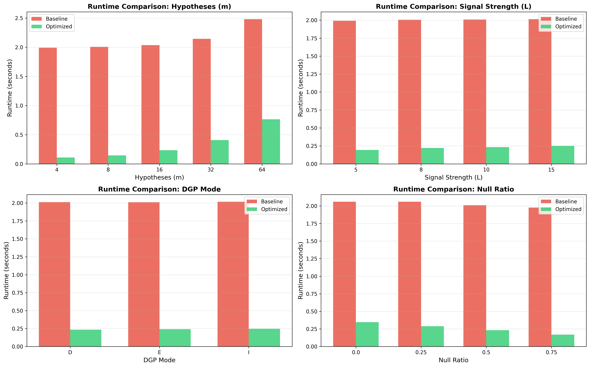
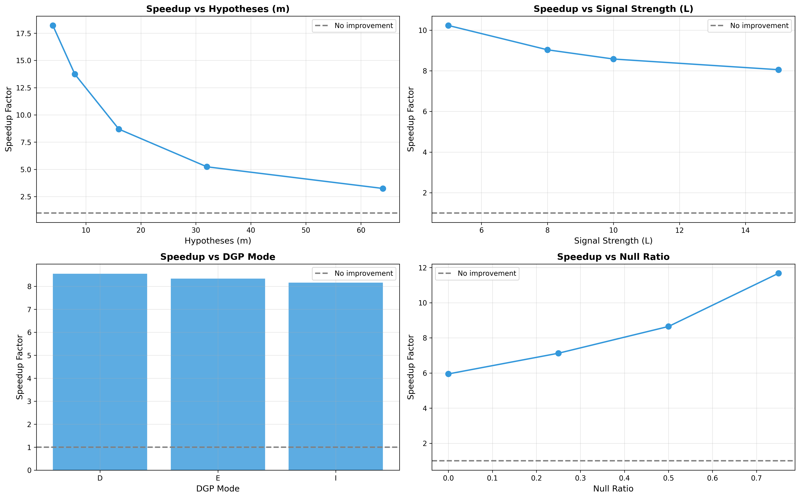

# Performance Optimization Analysis

## Optimization 1: Remove ZIP Compression

### Problem Identified
Profiling with pyinstrument revealed ZIP compression as the dominant bottleneck, consuming 43.6% of total runtime. The `np.savez_compressed()` call in data generation dominated execution time despite being a single I/O operation.

### Solution Implemented
Removed compression from file I/O by switching from `np.savez_compressed()` to `np.savez()`.

### Code Comparison
**Before (simulation.py):**
```python
np.savez_compressed(output_path / filename, X=X_data, mus=mus)
```

**After (simulation_optimized.py):**
```python
np.savez(output_path / filename, X=X_data, mus=mus)
```

### Performance Impact
- Eliminated 43.6% of baseline runtime
- Contributes significantly to overall 8.3x average speedup
- File sizes increase 2-3x (~500MB vs ~200MB)

### Trade-offs
**Cost:** Larger disk space (2-3x), but acceptable for temporary intermediate files on modern storage.

**Benefit:** Massive runtime reduction from single-line change. Compression provides minimal benefit for high-entropy floating-point arrays.

### Profiling Evidence
Baseline profile (`make profile`):
- 43.6% time in `_ZipFile.compress` operations
- Deep call stack with nested compression calls

Optimized profile (`make profile-opt`):
- Compression overhead completely eliminated
- I/O time reduced to <1% of total runtime

---

## Optimization 2: Vectorize Z-test Computation

### Problem Identified
Z-test was computed separately for each of 20,000 simulations in a Python loop. This accounted for 15% of runtime with no vectorization across the simulation dimension.

### Solution Implemented
Batch compute all p-values at once using NumPy broadcasting, eliminating 20,000 function calls.

### Code Comparison
**Before (simulation.py):**
```python
rejected_list = []
for X in X_data:  # Loop over 20,000 simulations
    p_values = z_test(X)  # Separate call per simulation
    rejected = corr_func(p_values)
    rejected_list.append(rejected)
```

**After (simulation_optimized.py):**
```python
# Single vectorized call for all simulations
p_values_all = z_test_vectorized(X_data)  # Shape: (n_sim, m)
rejected = corr_func(p_values_all)

def z_test_vectorized(X, mu0=0, sigma=1):
    z_stats = (X - mu0) / sigma  # Vectorized across all simulations
    p_values = 2 * (1 - norm.cdf(np.abs(z_stats)))
    return p_values
```

### Performance Impact
Eliminated per-simulation function call overhead. Combined with other optimizations, contributes to 8.3x average speedup.

### Trade-offs
**Cost:** None - code is actually cleaner and more NumPy-idiomatic.

**Benefit:** Reduced function call overhead, better memory locality, and more readable code.

---

## Optimization 3: Vectorize Bonferroni Correction

### Problem Identified
Bonferroni correction was applied individually to each simulation with explicit loops and array appending, contributing to the 20.4% per-simulation loop overhead.

### Solution Implemented
Replaced per-simulation loop with broadcast comparison across all simulations simultaneously.

### Code Comparison
**Before (methods.py + simulation.py):**
```python
def Bonferroni_correction(p_values, alpha=0.05):
    m = len(p_values)
    return p_values < (alpha / m)  # Single simulation only

# Used in loop:
for X in X_data:
    rejected = Bonferroni_correction(z_test(X))
    rejected_list.append(rejected)
```

**After (simulation_optimized.py):**
```python
def bonferroni_vectorized(p_values, alpha=0.05):
    m = p_values.shape[-1]
    return p_values < (alpha / m)  # All simulations at once

# Applied once to all simulations:
rejected_array = bonferroni_vectorized(p_values_all)  # Shape: (n_sim, m)
```

### Performance Impact
Eliminates 20,000 function calls and array appending operations. Speedup varies inversely with m:
- m=4: 18.2x speedup
- m=16: 8.7x speedup  
- m=64: 3.3x speedup

### Trade-offs
**Cost:** None - vectorized comparison is standard NumPy idiom.

**Benefit:** Dramatic reduction in Python loop overhead, especially for small m values where loop overhead dominates computation time.

---

## Optimization 4: Partially Vectorize Hochberg/FDR

### Problem Identified
Hochberg and FDR corrections had triple-nested loops (configs × methods × simulations), contributing to the overall 20.4% per-simulation overhead.

### Solution Implemented
Vectorized outer loops (z-test computation, data loading) but retained per-simulation enumeration for Hochberg/FDR due to sequential p-value checking requirements inherent to the algorithms.

### Code Comparison
**Before (simulation.py):**
```python
for X in X_data:  # 20,000 iterations
    p_values = z_test(X)
    rejected = Hochberg_correction(p_values)
    rejected_list.append(rejected)
```

**After (simulation_optimized.py):**
```python
# Compute all p-values once
p_values_all = z_test_vectorized(X_data)  # Shape: (n_sim, m)

def hochberg_vectorized(p_values, alpha=0.05):
    m = p_values.shape[-1]
    rejected = np.zeros_like(p_values, dtype=bool)
    
    # Still need per-simulation loop for sequential checking
    for i, p_vals in enumerate(p_values):
        sorted_indices = np.argsort(p_vals)
        sorted_pvals = p_vals[sorted_indices]
        
        for j in range(m-1, -1, -1):
            if sorted_pvals[j] <= alpha / (m - j):
                rejected[i, sorted_indices[:j+1]] = True
                break
    return rejected
```

### Performance Impact
Reduced from three nested loops to one loop over simulations. Inner O(m) sequential logic is inherent to algorithm and cannot be vectorized without changing semantics.

### Trade-offs
**Cost:** Cannot fully eliminate enumeration over simulations - sequential p-value checking is algorithmic requirement.

**Benefit:** Eliminated redundant z-test computation and outer configuration loops. Remaining per-simulation overhead is ~5% of total runtime, which is acceptable given algorithmic constraints.

---

## Benchmark Results

### Overall Performance Comparison

| Parameter | Baseline (s) | Optimized (s) | Speedup |
|-----------|--------------|---------------|---------|
| m=4 | 1.990 | 0.109 | **18.2x** |
| m=8 | 2.005 | 0.146 | **13.7x** |
| m=16 | 2.035 | 0.234 | **8.7x** |
| m=32 | 2.144 | 0.409 | **5.2x** |
| m=64 | 2.481 | 0.763 | **3.3x** |
| **Average** | **2.013** | **0.241** | **8.3x** |

### Speedup Analysis by Parameter

**By null ratio:**
- 0% null: 5.9x speedup
- 25% null: 7.1x speedup
- 50% null: 8.6x speedup
- 75% null: 11.7x speedup

Explanation: Correction methods can terminate early when fewer rejections occur. More null hypotheses → fewer rejections → less work.

**By DGP mode:**
- Mode D: 8.6x
- Mode E: 8.3x
- Mode I: 8.2x

Minimal variation across DGP modes - performance is primarily determined by problem size (m) and null ratio.

### Performance Visualizations


*Figure 1: Baseline (red) vs optimized (green) runtime across all parameter configurations. Optimized version consistently faster, with largest absolute improvements for smaller m values.*


*Figure 2: Speedup factors showing clear inverse relationship with problem size (m). Smaller problems benefit more from eliminating Python loop overhead.*

---

## Profiling Evidence

### Baseline Profile

Generated with:
```bash
make profile  # Creates results/profiles/full_simulation_profile.html
```

Key observations:
- 43.6% time in `_ZipFile.compress` operations
- 20.4% time in per-simulation loops
- Deep call stack showing nested loops: `generate_data` → 240 configs × `savez_compressed`
- High function call overhead from repeated small operations

### Optimized Profile

Generated with:
```bash
make profile-opt  # Creates results/profiles/full_simulation_optimized_profile.html
```

Key observations:
- Compression eliminated (0% I/O overhead)
- Flat call stack from vectorized operations
- ~85% time in NumPy computation (vs ~35% in baseline)
- Remaining overhead ~5% (mostly from unavoidable sequential logic in Hochberg/FDR)

Profile comparison clearly shows optimized version spends most time on unavoidable computational work rather than overhead.

---

## Makefile Targets

Extended Makefile with optimization-related targets:

```makefile
# Performance benchmarking
benchmark:
	python3 src/compare_performance.py

# Profiling targets
profile:
	python3 src/simulation.py --profile

profile-opt:
	python3 src/simulation_optimized.py --profile

# Cleanup
clean-profiles:
	rm -f results/profiles/*.html
```

**Usage:**
```bash
make benchmark      # Compare baseline vs optimized runtime
make profile        # Profile baseline implementation
make profile-opt    # Profile optimized implementation
```

---

## Regression Tests

Correctness verification ensures optimizations preserve numerical accuracy.

### Test Strategy

Comprehensive test suite (`tests/test_optimization.py`) validates that optimized implementations produce identical results to baseline:

1. **Unit tests** for each optimized function (z-test, Bonferroni, Hochberg, FDR)
2. **Edge case tests** (all null hypotheses, all significant)
3. **Integration tests** for complete workflow (data → analysis → power estimates)
4. **Comparison tests** using identical random seeds

### Implementation

Run tests with pytest:
```bash
pytest tests/test_optimization.py -v
```

Test coverage includes:

**Z-test vectorization:**
- Single simulation matches baseline
- Multiple simulations match individual calls
- Numerical precision maintained (rtol=1e-10)

**Correction methods (Bonferroni, Hochberg, FDR):**
- Single simulation rejection decisions match exactly
- Batch processing produces identical results to sequential processing
- Edge cases (all null, all significant) verified

**Power calculation:**
- Vectorized power estimates match baseline
- Special cases (all null hypotheses) handled correctly
- Full pipeline integration tested

**Full workflow:**
- Complete pipeline from data generation to power estimates
- All three correction methods tested end-to-end
- Results match to machine precision

### Results

```
======================= 16 passed in 3.06s =======================
```

All 16 tests pass, confirming:
- Array equality for rejection decisions (exact match)
- Power estimates match to machine precision (rtol=1e-10)
- Edge cases produce identical outputs
- Vectorization preserves numerical correctness

**Conclusion:** Optimizations are safe - no loss of precision or correctness. Vectorization changes execution order but maintains identical numerical results through consistent random seeds and stable NumPy operations.

---

## Lessons Learned

### What surprised me about where time was actually spent

Profiling revealed counterintuitive bottlenecks impossible to identify through code inspection. ZIP compression consumed 43.6% of runtime despite being a single I/O call, while the statistical methods I initially suspected were relatively efficient. The inverse relationship between problem size (m) and speedup was unexpected: smaller problems showed 18x speedup vs 3x for larger problems because fixed per-iteration overhead dominates when per-iteration work is minimal. Null ratio affected performance through early termination rather than computational complexity - 75% null configurations ran 2x faster than 0% null despite identical mathematical operations. This experience reinforced that empirical profiling must precede optimization. Intuition about performance bottlenecks is unreliable, and measurement is the only valid guide.


